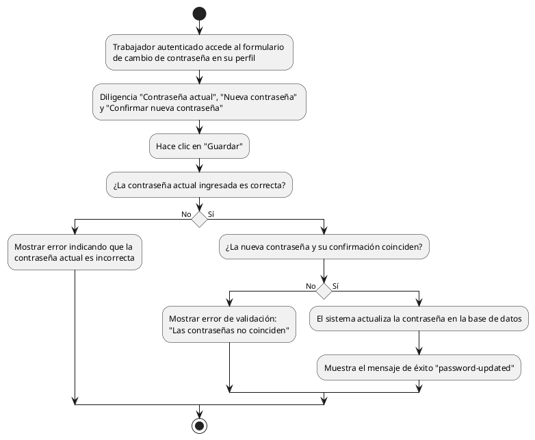

# Diagrama de Actividades: HU-TRB-004 (Cambiar Contraseña Autenticado)

**Historia de Usuario:** HU-TRB-004
**Rol:** Trabajador
**Acción:** Cambiar mi contraseña actual estando autenticado en el sistema.
**Propósito:** Actualizar credenciales de acceso por seguridad.

**Casos de Uso:**
1. **Cambio exitoso:** Ingresa datos válidos, actualiza y muestra éxito.
2. **Actual incorrecta:** Muestra error de validación indicando contraseña incorrecta.
3. **Nuevas no coinciden:** Muestra error y no actualiza contraseñas.

---

### Código PlantUML

