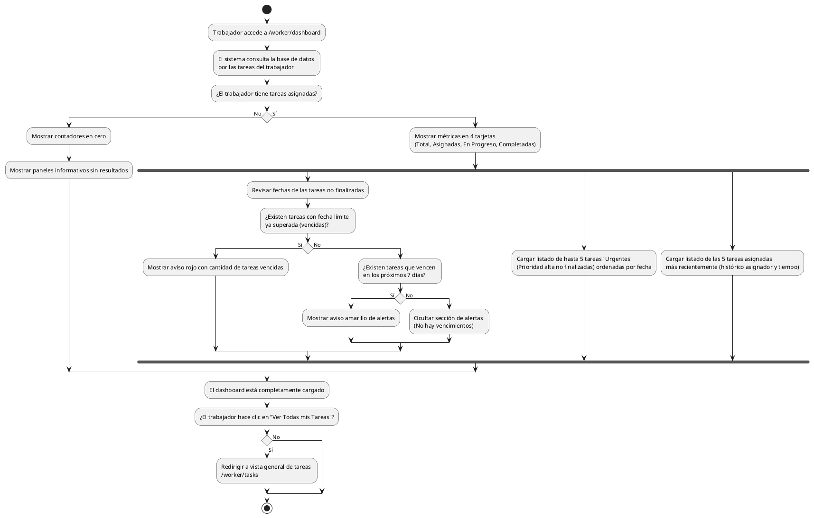

# Diagrama de Actividades: HU-TRB-005 (Dashboard / Estado general)

**Historia de Usuario:** HU-TRB-005
**Rol:** Trabajador
**Acción:** Ver un resumen general del estado de mis tareas asignadas.
**Propósito:** Tener visibilidad inmediata sobre tareas pendientes, urgentes y vencidas.

**Casos de Uso:**
1. **Métricas de tareas:** 4 tarjetas: total, asignadas, en progreso, completadas.
2. **Alerta tareas vencidas:** Aviso rojo con cantidad vencida (no finalizadas/canceladas).
3. **Alerta fechas próximas:** Aviso amarillo con tareas que vencen en 7 días.
4. **Sin vencimientos:** Oculta la sección de alertas.
5. **Tareas urgentes:** 5 tareas de prioridad alta no finalizadas, orden ascendente por límite.
6. **Tareas recientes:** 5 asignaciones recientes con admin y tiempo.
7. **Dashboard sin tareas:** Contadores cero y mensajes de vacío.
8. **Ver Todas:** Enlace rápido al listado completo en `/worker/tasks`.

---

### Código PlantUML

