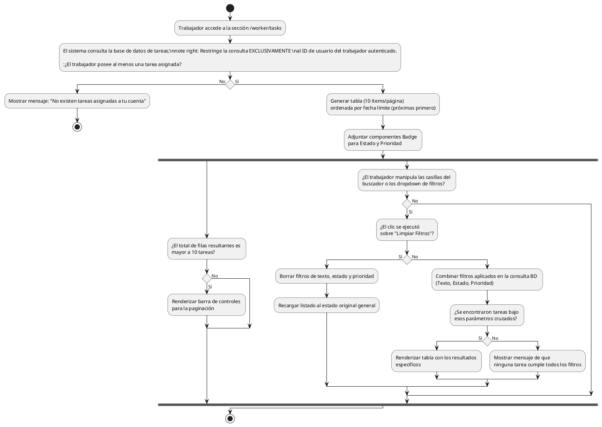

# Diagrama de Actividades: HU-TRB-006 (Listado Completo de Tareas)

**Historia de Usuario:** HU-TRB-006
**Rol:** Trabajador
**Acción:** Ver el listado completo de todas las tareas asignadas.
**Propósito:** Tener una vista organizada de todas mis responsabilidades de mantenimiento y su estado actual.

**Casos de Uso:**
1. **Lista con datos:** Muestra tabla paginada (10 por web) ordenada por fecha límite ascendente. Visualiza título, administrador, estado, prioridad y límite.
2. **Lista vacía:** Muestra mensaje si el trabajador no tiene ninguna asignación.
3. **Búsqueda por texto:** Filtra tareas por título o descripción.
4. **Filtrado por estado:** Muestra únicamente tareas con ese estado seleccionado.
5. **Filtrado por prioridad:** Muestra únicamente tareas con la prioridad seleccionada.
6. **Combinación de filtros:** Filtro simultáneo de texto, estado y prioridad.
7. **Limpieza de filtros:** Borra los selectores y recarga la tabla completa.
8. **Paginación:** Activa controles si existen más de 10 tareas filtradas o base.
9. **Visualización estricta (Privacidad):** Garantiza que sólo vea las tareas que están a su nombre.
10. **Badge dinámico:** Renderiza colores para el estado y para la prioridad.

---

### Código PlantUML

