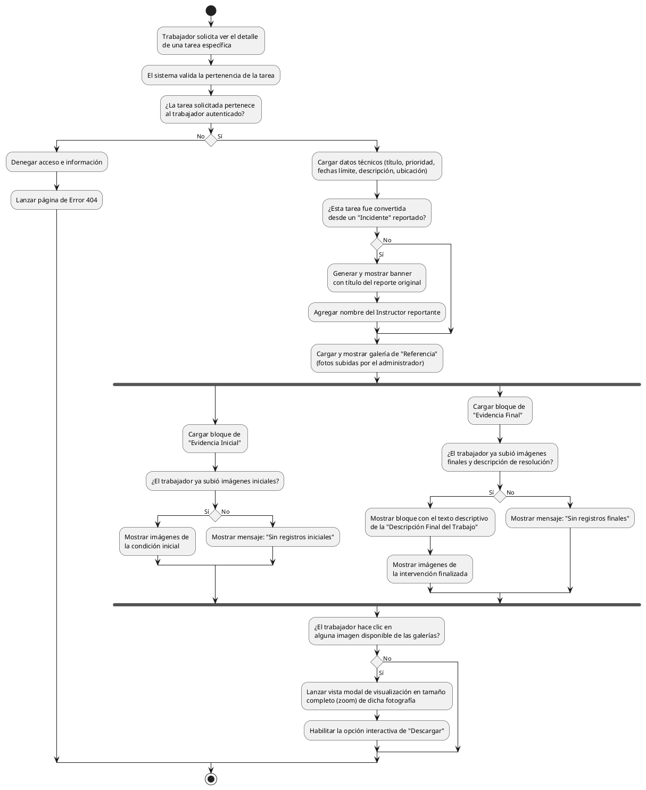

# Diagrama de Actividades: HU-TRB-007 (Detalle de Tarea)

**Historia de Usuario:** HU-TRB-007
**Rol:** Trabajador
**Acción:** Ver el detalle completo de una tarea que me ha sido asignada.
**Propósito:** Conocer todas las especificaciones del trabajo a realizar.

**Casos de Uso:**
1. **Ver detalle completo:** Título, estado, prioridad, descripción, ubicación, fecha límite, asignador.
2. **Aviso vinculación:** Si la tarea nació de un incidente, un banner indica el título original.
3. **Galería inicial (Admin):** Muestra fotos de referencia brindadas por quien asigna la tarea.
4. **Galería inicial (Trabajador):** Muestra fotos subidas por el trabajador de cómo encontró el fallo (o "Sin registros").
5. **Galería final (Trabajador):** Muestra fotos subidas del arreglo realizado (o "Sin registros").
6. **Zoom múltiple:** Clic en cualquier foto lanza un modal para ver ampliada (con botón descarga).
7. **Descripción final:** Si ya culminó el trabajo, expone en un bloque su comentario o descripción de cierre.
8. **Acceso denegado (Seguridad):** 404 si fuerza en URL el ID de una tarea de otro operario.

---

### Código PlantUML

