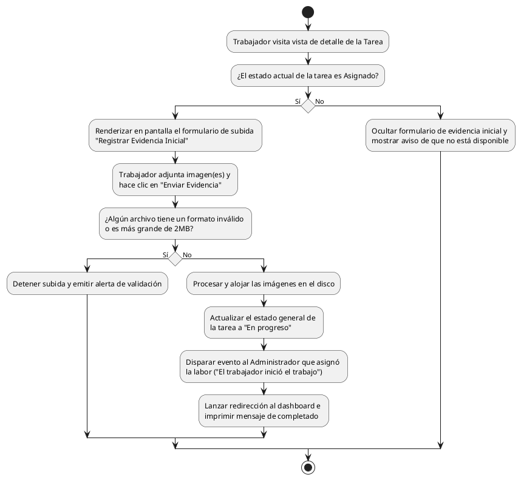

# Diagrama de Actividades: HU-TRB-008 (Registrar Evidencia Inicial)

**Historia de Usuario:** HU-TRB-008
**Rol:** Trabajador
**Acción:** Registrar imágenes de la condición inicial de la falla cuando llego al lugar.
**Propósito:** Documentar el estado inicial y notificar al administrador que el trabajo ha comenzado.

**Casos de Uso:**
1. **Formato hábil:** Carga la vista para enviar fotos si la tarea está en estado **Asignado**.
2. **Bloqueo de formulario:** Si el trabajo avanza (ej. *En Progreso*), desaparece la opción de añadir fotos de estado inicial.
3. **Subida exitosa:** Guarda archivos, cambia la tarea a "En Progreso", y notifica al asignador.
4. **Notificación admin:** El creador de la tarea recibe ping de arranque de labor.
5. **Validación - Formato inválido:** Error si mete archivos no permitidos (solo jpg/jpeg/png/gif).
6. **Validación - Sobrepeso:** Error si el archivo excede los 2MB de peso.

---

### Código PlantUML

