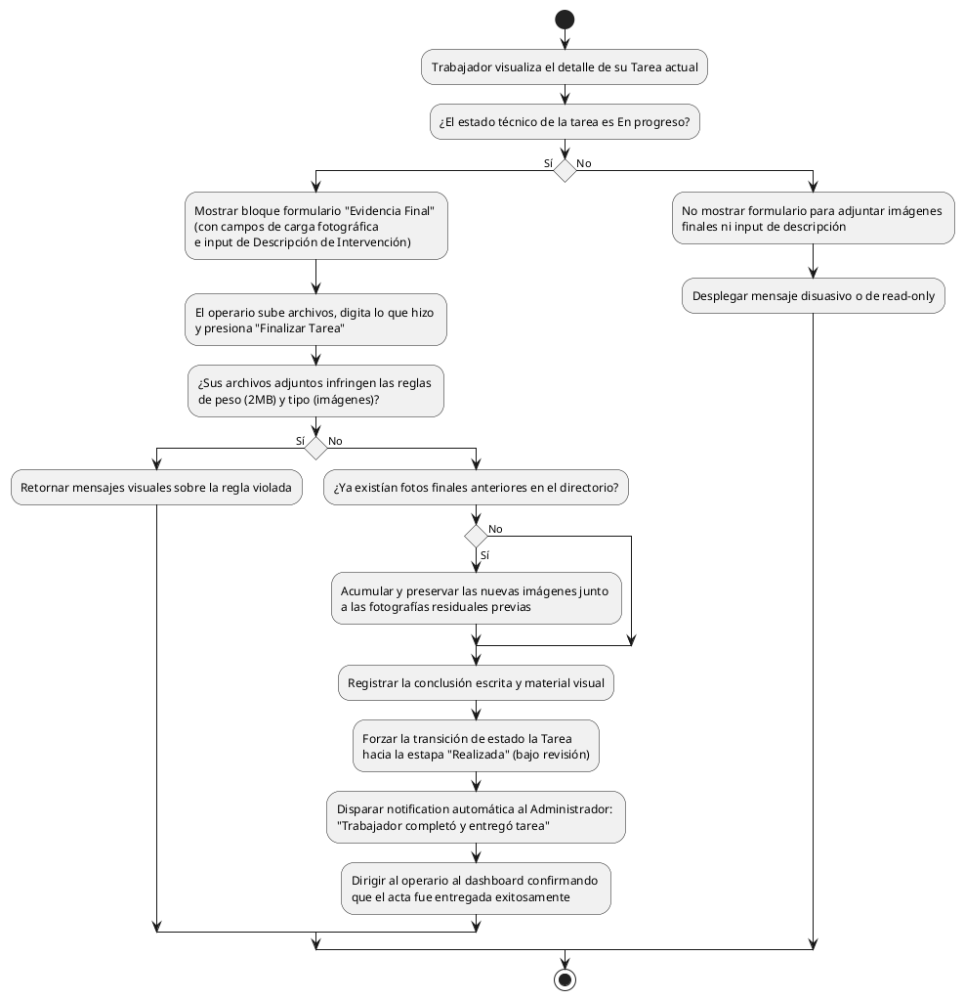

# Diagrama de Actividades: HU-TRB-009 (Registrar Evidencia Final)

**Historia de Usuario:** HU-TRB-009
**Rol:** Trabajador
**Acción:** Registrar imágenes del trabajo completado y describir la intervención.
**Propósito:** Documentar el resultado y enviar la tarea a revisión del administrador.

**Casos de Uso:**
1. **Formulario hábil:** Solo es visible para adjuntar fotos finales y memoria descriptiva si la carga actual del trabajo está **En Progreso**.
2. **Bloqueo de formulario:** Si el trabajo pasa a **Realizada**, se inhabilita nuevas ediciones.
3. **Subida exitosa:** Transiciona la tarea a culminada (por revisión) -> "Realizada", emite aviso al administrador.
4. **Notificación admin:** Ping automático: "El trabajador envió la tarea para su revisión".
5. **Acumulativas:** Si se añaden nuevas evidencias (ej. por rechazo administrativo previo que lo vuelve "en progreso"), las fotos no se borran, sino que se suman en la galería.
6. **Validaciones de archivo:** Errores frente a excesos de la cuota 2MB o ficheros corruptos/no soportados.

---

### Código PlantUML

