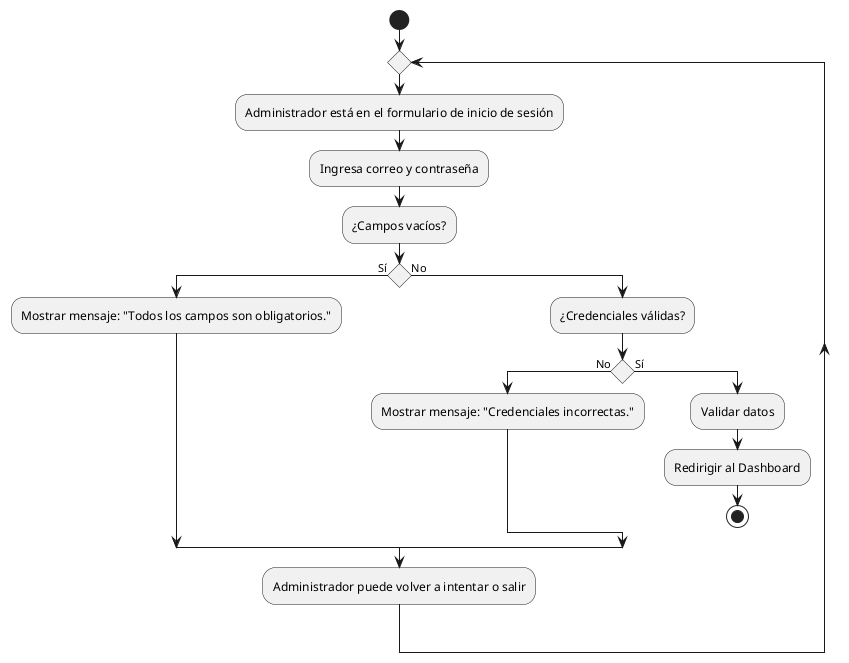

# Ejemplo de Diagrama de Actividades

```plantuml
@startuml
skinparam ConditionEndStyle hline
start
repeat
:Administrador está en el formulario de inicio de sesión;
:Ingresa correo y contraseña;
:¿Campos vacíos?;
if () then (Sí)
:Mostrar mensaje: "Todos los campos son obligatorios.";
else (No)
:¿Credenciales válidas?;
if () then (No)
:Mostrar mensaje: "Credenciales incorrectas.";
else (Sí)
:Validar datos;
:Redirigir al Dashboard;
stop
endif
endif
:Administrador puede volver a intentar o salir;
repeat while
@enduml
```
