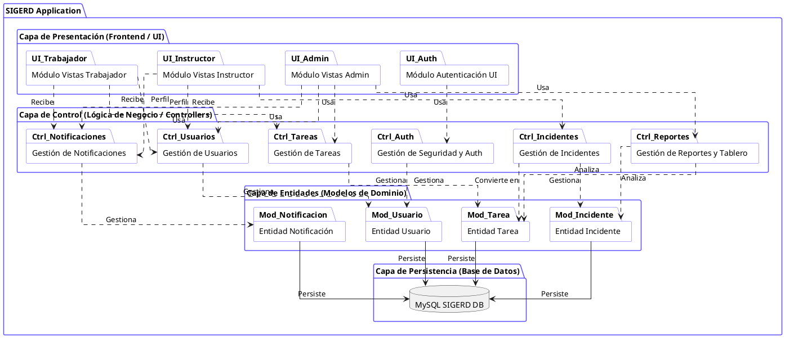

# Diagrama de Paquetes - SIGERD

A continuación se presenta el código fuente en formato **PlantUML** del diagrama de paquetes del sistema SIGERD. Este diagrama muestra la estructura modular lógica del sistema, organizada por las capas arquitectónicas principales (Presentación, Lógica de Negocio / Controladores, y Acceso a Datos / Modelos) y las dependencias entre estos paquetes.

---

## Código PlantUML

### Notas sobre el diagrama
- **Capa de Presentación:** Incluye todos los componentes visuales e interfaces con las que el usuario interactúa, separados por perfil de usuario o módulo lógico (`Vistas Admin`, `Trabajador`, `Instructor`, y el `Módulo de Autenticación`).
- **Capa de Control:** Agrupa la lógica de negocio y los controladores responsables de procesar las solicitudes HTTP y coordinar las acciones (`Gestión de Usuarios`, `Tareas`, `Incidentes`, `Notificaciones` y `Reportes`).
- **Capa de Entidades:** Contiene las representaciones de los datos del sistema (`Modelos/Clases` de Eloquent), incluyendo las reglas fundamentales del dominio de la aplicación (`Usuario`, `Tarea`, `Incidente`, `Notificación`).
- **Capa de Persistencia:** Representa el gestor de base de datos relacional en este caso la base de datos MySQL, asegurando el almacenamiento estructurado y persistente de la información.
- **Dependencias:** Las flechas punteadas (`..>`) denotan dependencia, es decir, una capa requiere de los servicios o la información proporcionada por otra inferior. Las líneas con puntas sólidas indicando una relación de persistencia con el sistema de base de datos. Esto respeta el flujo de la arquitectura Modelo-Vista-Controlador (MVC) y promueve el desacoplamiento.
