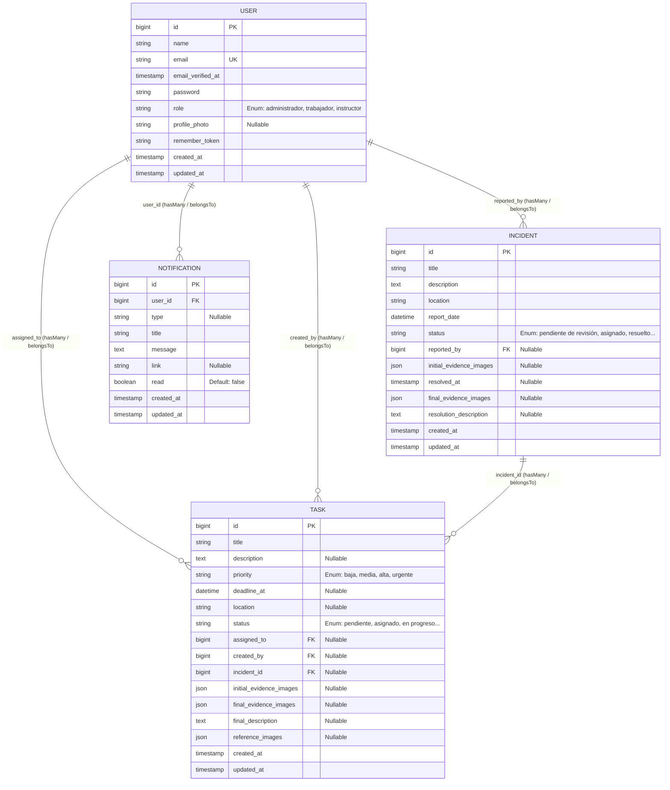

# Modelo de Base de Datos - SIGERD

A continuación se presenta el Diagrama de Entidad-Relación (ERD) del aplicativo SIGERD, generado a partir de su esquema de modelos y migraciones en Laravel.

## Descripción de Relaciones

1. **User a Task (`assigned_to`)**: Relación de uno a muchos (1:N). Un usuario con rol de `trabajador` puede tener varias tareas asignadas para su ejecución. La llave foránea en `tasks` es `assigned_to` apuntando a `users.id`.
2. **User a Task (`created_by`)**: Relación de uno a muchos (1:N). Un usuario (por lo general `administrador`) es el creador de múltiples tareas. La llave foránea en `tasks` es `created_by` apuntando a `users.id`.
3. **User a Incident (`reported_by`)**: Relación de uno a muchos (1:N). Un usuario con rol de `instructor` puede reportar o levantar múltiples incidentes. La llave foránea en `incidents` es `reported_by` apuntando a `users.id`.
4. **User a Notification (`user_id`)**: Relación de uno a muchos (1:N). El sistema genera avisos y alertas dirigidos a un usuario específico. La llave foránea en `notifications` es `user_id` apuntando a `users.id`.
5. **Incident a Task (`incident_id`)**: Relación de uno a muchos (1:N). Un incidente crítico reportado puede desencadenar la creación de una o más tareas de mantenimiento para solventarlo. La llave foránea en `tasks` es `incident_id` apuntando a `incidents.id`.

## Diccionario de Datos

Tabla 1. Diccionario de datos tabla **users** (usuarios)

| NOMBRE CAMPO | TIPO DATO | TAMAÑO | DESCRIPCIÓN |
| :--- | :--- | :--- | :--- |
| id | BIGINT UNSIGNED (PK) | 20 | Identificador único de usuario. |
| name | VARCHAR | 255 | Nombre completo del usuario. |
| email | VARCHAR (UNIQUE) | 255 | Correo electrónico del usuario (login). |
| email_verified_at | TIMESTAMP NULL | - | Fecha y hora de verificación del correo. |
| password | VARCHAR | 255 | Hash de la contraseña del usuario. |
| role | VARCHAR | 255 | Rol del usuario en el sistema (administrador, trabajador, instructor). |
| profile_photo | VARCHAR NULL | 255 | Ruta de la foto de perfil del usuario en el almacenamiento. |
| remember_token | VARCHAR NULL | 100 aprox. | Token para sesiones persistentes ("recuérdame"). |
| created_at | TIMESTAMP NULL | - | Fecha y hora de creación del registro. |
| updated_at | TIMESTAMP NULL | - | Fecha y hora de la última actualización del registro. |

Tabla 2. Diccionario de datos tabla **tasks** (tareas)

| NOMBRE CAMPO | TIPO DATO | TAMAÑO | DESCRIPCIÓN |
| :--- | :--- | :--- | :--- |
| id | BIGINT UNSIGNED (PK) | 20 | Identificador único de la tarea. |
| title | VARCHAR | 255 | Título descriptivo de la tarea de mantenimiento. |
| description | TEXT NULL | - | Descripción detallada de la tarea a realizar. |
| priority | VARCHAR | 255 | Nivel de prioridad (baja, media, alta, urgente). |
| deadline_at | DATETIME NULL | - | Fecha y hora límite estipulada para finalizar la tarea. |
| location | VARCHAR NULL | 255 | Ubicación física o área donde se realizará la tarea. |
| status | VARCHAR | 255 | Estado actual de la tarea (pendiente, asignado, en progreso, etc.). |
| assigned_to | BIGINT UNSIGNED (FK) NULL | 20 | ID del trabajador responsable asignado a la tarea. |
| created_by | BIGINT UNSIGNED (FK) NULL | 20 | ID del administrador que creó la tarea. |
| incident_id | BIGINT UNSIGNED (FK) NULL | 20 | ID del incidente originario (si la tarea deriva de uno). |
| initial_evidence_images | JSON NULL | - | Fotos de evidencia tomadas al iniciar la tarea. |
| final_evidence_images | JSON NULL | - | Fotos de evidencia tomadas al concluir la tarea. |
| final_description | TEXT NULL | - | Descripción final de resolución proporcionada por el trabajador. |
| reference_images | JSON NULL | - | Fotos de referencia o instructivas adjuntas a la tarea. |
| created_at | TIMESTAMP NULL | - | Fecha y hora de creación de la tarea. |
| updated_at | TIMESTAMP NULL | - | Fecha y hora de la última actualización. |

Tabla 3. Diccionario de datos tabla **incidents** (incidentes)

| NOMBRE CAMPO | TIPO DATO | TAMAÑO | DESCRIPCIÓN |
| :--- | :--- | :--- | :--- |
| id | BIGINT UNSIGNED (PK) | 20 | Identificador único del reporte de incidente. |
| title | VARCHAR | 255 | Título descriptivo de la falla o incidente. |
| description | TEXT | - | Descripción extensa del problema reportado. |
| location | VARCHAR | 255 | Ubicación física exacta donde ocurrió la falla. |
| report_date | DATETIME | - | Fecha y hora explícita en que se levantó el reporte. |
| status | VARCHAR | 255 | Estado del incidente (pendiente de revisión, asignado, resuelto, etc.). |
| reported_by | BIGINT UNSIGNED (FK) NULL | 20 | ID del instructor que reportó la falla. |
| initial_evidence_images | JSON NULL | - | Evidencia fotográfica adjunta al reportar la falla. |
| resolved_at | TIMESTAMP NULL | - | Fecha y hora en que el incidente fue marcado como resuelto. |
| final_evidence_images | JSON NULL | - | Fotos de evidencia mostrando la falla ya reparada. |
| resolution_description | TEXT NULL | - | Comentarios de cierre o descripción de la solución aplicada. |
| created_at | TIMESTAMP NULL | - | Fecha y hora de registro del incidente. |
| updated_at | TIMESTAMP NULL | - | Fecha y hora de la última actualización. |

Tabla 4. Diccionario de datos tabla **notifications** (notificaciones)

| NOMBRE CAMPO | TIPO DATO | TAMAÑO | DESCRIPCIÓN |
| :--- | :--- | :--- | :--- |
| id | BIGINT UNSIGNED (PK) | 20 | Identificador único de la notificación. |
| user_id | BIGINT UNSIGNED (FK) | 20 | ID del usuario receptor de la notificación. |
| type | VARCHAR NULL | 255 | Categoría lógica de la notificación. |
| title | VARCHAR | 255 | Título corto o asunto de la notificación. |
| message | TEXT | - | Cuerpo ampliado o detalle funcional del aviso. |
| link | VARCHAR NULL | 255 | Ruta URL para redirigir al contexto de la notificación. |
| read | BOOLEAN (TINYINT) | 1 | Indicador de lectura (0 = no leída, 1 = leída). |
| created_at | TIMESTAMP NULL | - | Fecha y hora de emisión original de la alerta. |
| updated_at | TIMESTAMP NULL | - | Fecha y hora de la última modificación. |

